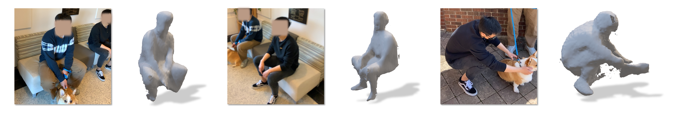

[](https://opensource.org/licenses/Apache-2.0)

<h1 align="center">Occupancy Planes (OPlanes) <br>for Single-view RGB-D Human Reconstruction</h1>
<p align="center"><b>AAAI 2023</b></p>


<p align="center">
  
</p>

**Occupancy Planes for Single-view RGB-D Human Reconstruction. AAAI 2023.**<br>
[Xiaoming Zhao](https://xiaoming-zhao.com/), [Yuan-Ting Hu](https://scholar.google.com/citations?user=aMpbemkAAAAJ&hl=en), [Zhongzheng Ren](https://jason718.github.io/), and [Alexander G. Schwing](https://www.alexander-schwing.de/).

### [Paper](https://arxiv.org/abs/2208.02817)

## Table of Contents

- [Environment Setup](#environment-setup)
- [Using Pretrained Checkpoints](#using-pretrained-checkpoints)
- [Training and Evaluation](#training-and-evaluation)
- [Citation](#citation)
- [Acknowledgements](#acknowledgements)

## Environment Setup

This code has been tested on Ubuntu 18.04 with CUDA 10.2.

```
conda env create -f environment.yaml
```

## Using Pretrained Checkpoints

### Download Checkpoints
```bash
cd /path/to/this/repo
export OPLANES_ROOT=$PWD
```

Please download our [pretrained checkpoints](https://drive.google.com/drive/folders/12NpmG-yhIEeSR81iVL9bSCqmdi5RaCBv?usp=sharing) and place them under `${OPLANES_ROOT}/ckpts`. The structure should be:
```
.
+-- ckpts
|  +-- pretrained
|  |  +-- seed_0
|  |  |  +-- config.pth
|  |  |  +-- checkpoints
|  |  |  |  +-- model-oplanes-s3d-epoch=14-val_acc=0.9204.ckpt
|  |  +-- seed_1
|  |  +-- seed_2
```

### Reconstruction from single RGB-D Image

We provide a script to reconstruct mesh for human from single-view RGB-D image. We use the sample data in `./datasets/examples/in_the_wild` for illustration purpose.

To use pretrained oplanes model, we require the following data format (`XXX` is a unique ID you define to distinguish different images):

- `XXX_rgb.png`: a 8-bit RGB image containing the human to be reconstructed;
- `XXX_mask.png`: a single-channel mask to indicate the human to be reconstructed;
- `XXX_depth.npz`: a binary file containing a single-channel depth map with the same resolution as the RGB image, we use `np.load('XXX_depth.npz')['depth']` to load the depth map;
- `XXX_cam_mat.npz`: a binary file containing camera matrice. Assume `cam_mat_dict = np.load('XXX_cam_mat.npz')`, we have:
    - `cam_mat_dict['intri']`: a 4x4 intrinsic matrix;
    - `cam_mat_dict['extri']`: a 4x4 extrinsic matrix for transforming coordinates from world to camera;
    - `cam_mat_dict['nons3d_to_s3d']`: a 4x4 matrix to transform from your camera coordinate system to S3D's camera coordiante system. Specifically, S3D has **+X right, +Y up, +Z backward**. Assume your camera coordinate system has **+X right, +Y down, +Z forward**, then the transformation matrix should be:
    ```
    [[1, 0, 0],
     [0, -1, 0],
     [0, 0, -1]]
    ```

After preparing the data, run the following command:

```bash
conda activate oplanes && \
export PYTHONPATH=${OPLANES_ROOT}:$PYTHONPATH && \
python ${OPLANES_ROOT}/oplanes/eval/gen_mesh_nons3d.py \
--nproc 1 \
--rgb_f_list ${OPLANES_ROOT}/datasets/examples/in_the_wild/00000_rgb.png \
--save_root ${OPLANES_ROOT}/outputs/in_the_wild \
--ckpt_f ${OPLANES_ROOT}/ckpts/pretrained/seed_0/checkpoints/model-oplanes-s3d-epoch=14-val_acc=0.9204.ckpt \
--n_bins 256 \
--use_graph_cut 0 \
--smooth_mcube 1
```

Reconstructed mesh will be saved in `./outputs/in_the_wild/meshes`.

If you want to use GraphCut for a smoother reconstruction, you can turn it on via setting `--use_graph_cut 1`. Note, GraphCut may take several minutes to complete.

Note, we use [medpy](https://github.com/loli/medpy/) for GraphCut. You need to install it with the GraphCut support. See [this](http://loli.github.io/medpy/installation/graphcutsupport.html). If you want to install it from the source, we use the commit `39131b9`.


## Training and Evaluation
Please refer to [TRAIN_EVAL.md](./TRAIN_EVAL.md) for more details.

## Citation
>Xiaoming Zhao, Yuan-Ting Hu, Zhongzheng Ren, and Alexander G. Schwing. Occupancy Planes for Single-view RGB-D Human Reconstruction. AAAI 2023.
```
@inproceedings{ZhaoOplanes2023,
  title={{Occupancy Planes for Single-view RGB-D Human Reconstruction}},
  author={Xiaoming Zhao and Yuan-Ting Hu and Zhongzheng Ren and Alexander G. Schwing},
  booktitle={AAAI},
  year={2023},
}
```

## Acknowledgements

- Binvox file reader/writer is adopted from [binvox-rw-py](https://github.com/dimatura/binvox-rw-py).
- The evaluation code is adopted from [Occupancy Networks](https://github.com/autonomousvision/occupancy_networks).